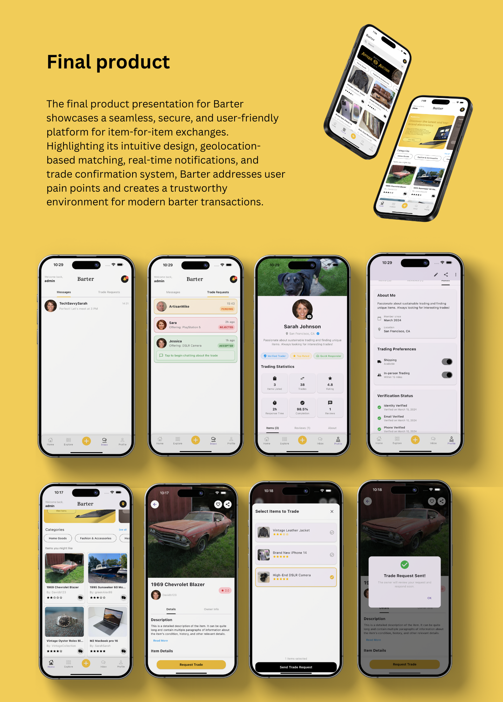

# 🎨 Barter Exchange
<div align="center">
  
</div>

## 🌟 About Barter

Barter is a modern, intuitive trading platform built with Flutter that revolutionizes the way people exchange goods and services. Our platform makes trading simple, secure, and enjoyable.

## ✨ Features

- 🔄 Seamless item trading
- 🔒 Secure transactions
- 📱 Beautiful, responsive design
- 🎯 User-friendly interface
- 🔍 Advanced search capabilities
- 💬 Real-time messaging

## 🚀 Getting Started

### Prerequisites

- Flutter SDK (latest version)
- Dart SDK (latest version)
- Android Studio / Xcode
- Git

### Installation

1. Clone the repository:
```bash
git clone https://github.com/yourusername/barter.git
```

2. Navigate to the project directory:
```bash
cd barter
```

3. Install dependencies:
```bash
flutter pub get
```

4. Run the app:
```bash
flutter run
```

## 🛠️ Built With

- [Flutter](https://flutter.dev/) - The UI framework
- [Dart](https://dart.dev/) - The programming language
- [Firebase](https://firebase.google.com/) - Backend services

## 📱 Screenshots

<div align="center">
  
</div>

## 🤝 Contributing

We welcome contributions! Please feel free to submit a Pull Request.

## 📄 License

This project is licensed under the MIT License - see the [LICENSE](LICENSE) file for details.

## 📞 Contact

For any questions or suggestions, please reach out to us at [your-email@example.com](mailto:your-email@example.com)

---

<div align="center">
  <p>Made with ❤️ by the Barter Team</p>
</div>

<style>
  body {
    background-color: #fff9e6;
  }
  h1, h2, h3 {
    color: #ffb700;
  }
  a {
    color: #ff8c00;
  }
  code {
    background-color: #fff3d4;
  }
</style>
